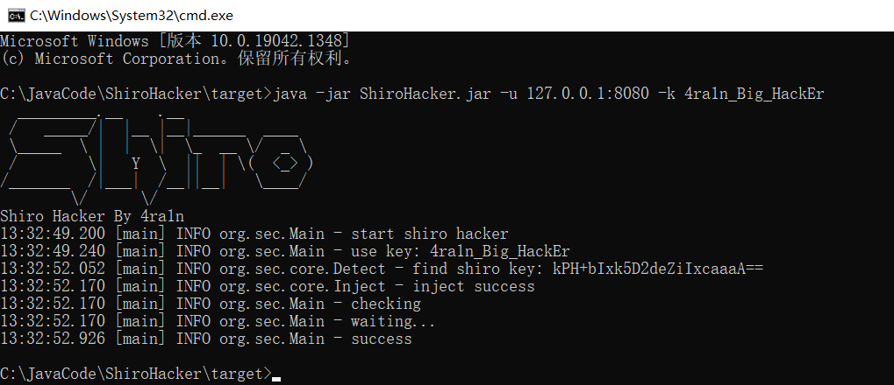

# ShiroHacker

## 简介

什么是`ShiroHacker`

白帽子在挖掘漏洞的时候，经常会遇到抢洞的情况

是否能够创造一个只属于你一人的`Shiro`反序列化漏洞：只要你挖到，从此以后再不会有其他人能够挖到这个洞

（该工具只针对于`SpringBoot/SpringMVC`配合`Shiro`的情况，这也是最广泛的情况）

## 使用

和普通`Shiro`工具一样，本工具会首先扫描`key`并输出

然后会用`Shiro`原生反序列化链`CB1`构造`Payload`打过去

这个`Payload`的逻辑是反射修改服务端的`Key`，需要修改三处地方

- AbstractRememberMeManager.DEFAULT_CIPHER_KEY_BYTES
- CookieRememberMeManager.encryptionCipherKey
- CookieRememberMeManager.decryptionCipherKey

只修改第一处不会生效，需要获取`Spring`的`Context`拿到`CookieRememberMeManager`的`Bean`修改后两处

命令：`java -jar ShiroHacker.jar -u [TARGET_URL] -p [YOUR_NEW_KEY]`

注意：请提供16位长度的`Key`否则会影响到服务端正常的业务逻辑

## 感谢

感谢天下大木头师傅提供帮助：https://github.com/KpLi0rn

提出该技术的文章：https://xz.aliyun.com/t/9450

## 免责申明

**未经授权许可使用`JSPHorse`攻击目标是非法的**

**本程序应仅用于授权的安全测试与研究目的**

